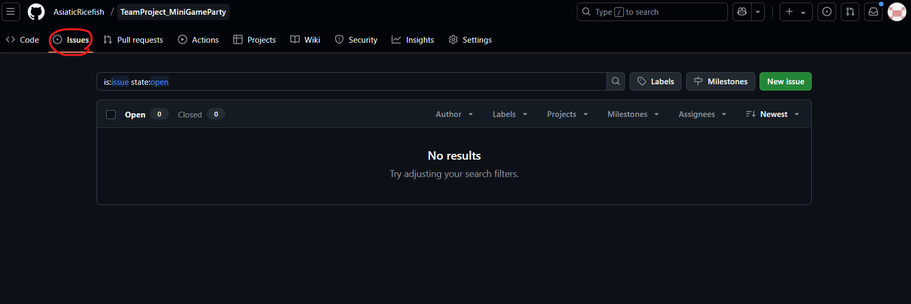
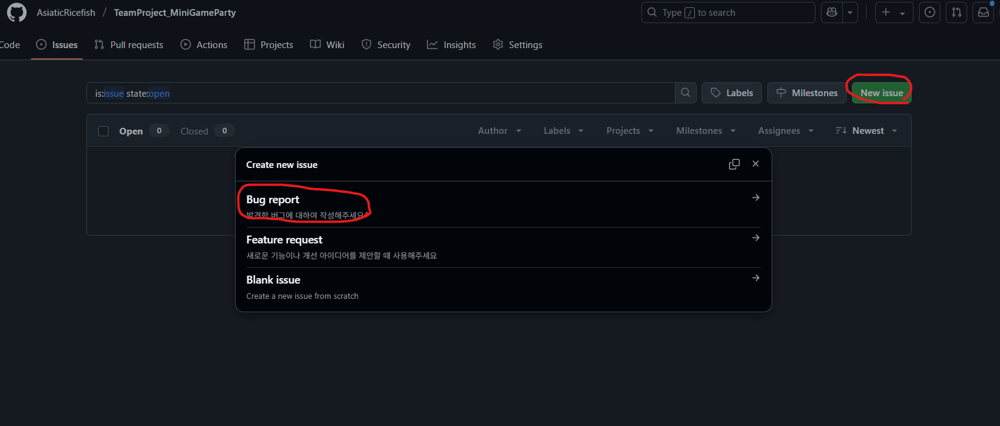
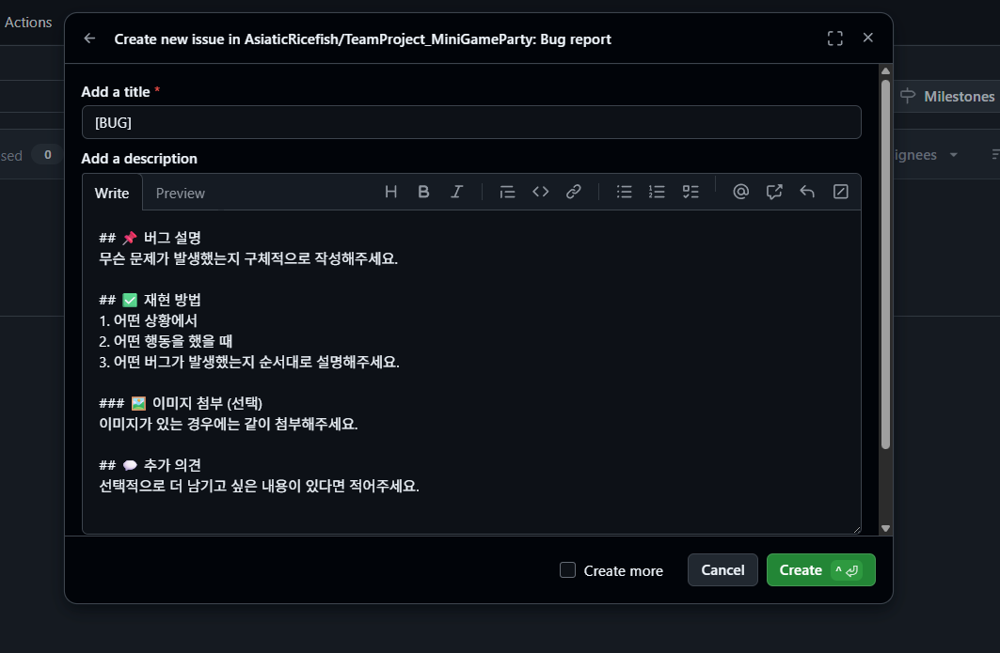
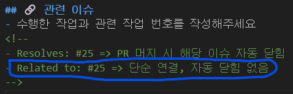
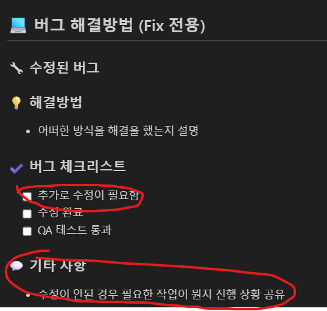
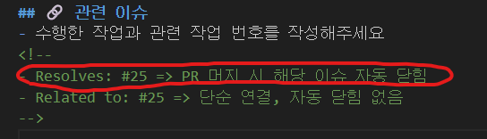

# 🎉 MobilePartyGame
 **3D 캐주얼 파티 게임으로, 짧고 간편하게 즐길 수 있는 멀티플레이 미니게임 모음집입니다.**

 ## 🎮 장르  
  3D 캐주얼 파티

## 📱 플랫폼  
Mobile / Android

## 💡 핵심 컨셉
- 간편한 조작  
- 짧은 플레이 타임  
- 다양한 미니 게임  
- 귀여운 캐릭터 디자인

## 👥 게임 방식  
  4인 멀티플레이 게임

---
<br>
<br>

# ⌨️ Commit 메시지
### ✅ Type
- `[Feat]` 새로운 기능 추가
- `[Fix]` 버그 및 기능의 수정
- `[Set]` 프로젝트 설정 등 유니티 자체의 설정 변경
- `[Refactor]` 기능에 영향을 주지 않는 범위의 코드 수정(코드 리팩토링 등)
- `[Test]` 테스트에 관련된 모든 작업
- `[Docs]` 문서파일 수정(데이터시트 / CSV 등)
- `[Create]` 프로젝트 및 씬/스크립트/오브젝트/프리팹 등의 생성
- `[Add]` 리소스 및 에셋 등, 스크립트/오브젝트(프리팹) 외적인 파일 추가
- `[Comment]` 코드 주석 추가 / 수정 / 삭제

#### 💡 타입 종류에 기재되지 않은 단순 작업들은 타입을 기재하지 않는다.

<br>

### 🔊 버그 수정 가이드

#### 🕵️ 버그 발견 : Github issue 탭에 버그 리포트를 작성합니다!




#### ❌ 수정 중 : PR에서 해당 부분 작성 후 추가 작업

<br>


#### ✅ 수정 완료 : PR에서 관련 이슈 부분에서 해당 버그 리포트의 번호를 기입합니다



---
<br>

# 🗝️ Branch
### ✅ Main
- 정식 버전 빌드용 브랜치
- 실수 및 무분별한 수정을 막기 위해 엑세스 제한
- 개발 전용 브랜치에서의 Merge는 개발 팀장만 접근한다. 단, 예외 상황이 생기면 팀원도 접근할 수 있게 권한 삭제 진행 

### ✅ Develop
- 기능 개발/구현용 브랜치
- 팀원들은 이 브랜치에서 개인 작업 브랜치를 생성 후, 개별 작업 완료시 이 브랜치로 Merge한다.
- Merge시 Pull requests를 활용. 충돌 대비와 충돌 발생시의 대처를 모든 팀원이 서포트 할 수 있도록 한다.

### ✅ 기능 개발 브랜치 (이니셜 포함)
- 기능 단위 개발용 브랜치
- 생성 브랜치명 : 개인이니셜/feat-기능
  + ex> `LTH/feat-Item`
  + ex> `LTH/feat-inventory`

- 작업 내용이 짧더라도 브랜치 명으로 각자의 작업 진행상황을 공유하기 위해 가급적 정확히 기재한다.
- 기능 수정 및 구현이 끝나 필요 없어진 브랜치는 모든 팀원들 판단 하에 삭제한다.

### ✅ QA 버그 수정 브랜치
- 생성 브랜치 명 : QA/버그명
- develop에 머지된 코드 기준으로 QA 테스트 진행
- 버그 발생 시 → QA/버그명 브랜치 생성하여 수정
- 수정 완료 후 → 다시 develop에 PR
  + ex> `QA/item`
  + ex> `QA/door-not-opening`

---
<br>

# 📁 폴더 구조 및 네이밍 규칙
### ✅ 개인 작업 폴더
- 경로: `Assets/개인폴더(개인이니셜)`
- 개인 폴더 내부의 하위 폴더는 다음 규칙을 따른다.이니셜_폴더명
  +  예시: `LTH_Scene`, `LTH_Scripts`
- 완성된 리소스는 공용 폴더로 이동한다.

### ✅ 공용 폴더
- `Assets/Scripts` – 공용 스크립트 (충돌방지를 위해 사용을 안할 생각이지만 추후 필요시 사용 고려)
- `Assets/Scenes` – 완성된 씬 배치
- `Assets/Prefabs` – 공용 프리팹
- `Assets/Resources` - 런타임에 리소스를 로드(Load)할 수 있게 해주는 폴더

### ✅ Imports 폴더 (외부 에셋 전용)
- 경로: `Assets/Imports`
- 에셋스토어 등에서 가져온 외부 리소스를 보관한다.
- ⚠️ GitHub에는 절대 포함하지 않고, Ignore 처리

### ✅ 테스트 씬 네이밍 규칙
- 테스트용 씬 파일은 이름 앞에 Test_ 를 붙인다.
    + 예시: `Test_BattleUIScene`, `Test_PokemonSpawn`

### ✅ 폴더 구조 예시
```
Assets/
├── Prefabs/
├── Scenes/
├── Scripts/
├── Resources/
├── LTH/
│   └── LTH_Scripts/
│   └── LTH_Scenes/
│
└── Imports/  ← GitHub 업로드 제외
```